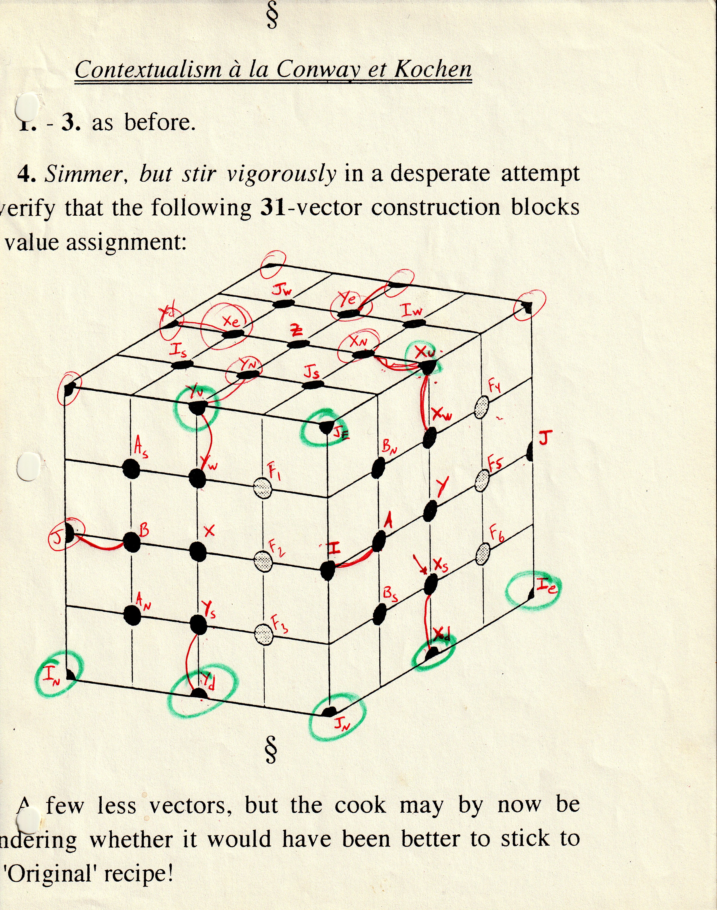

# Conway-Kochen 31-Vector Construction (3D)

## Source

Scanned from: "Contextualism à la Conway et Kochen" (textbook excerpt).

---

## Overview

The Conway-Kochen 31-vector construction is a refinement of the original Kochen-Specker 117-vector proof and Peres's 33-vector proof, reducing the set to **31 vectors** in 3-dimensional real Hilbert space while still blocking any noncontextual value assignment.

The diagram below shows the cube construction with labeled vectors at vertices, edge midpoints, and face centers. The coloring (green circles = value 1, red circles = value 0) demonstrates the contradiction: the constraints from overlapping orthogonal triads make consistent assignment impossible.

---

## Diagram

**"Contextualism à la Conway et Kochen"**

Steps 1–3 as before (same as the Peres 33-vector setup).

Step 4: *Simmer, but stir vigorously* in a desperate attempt to verify that the following **31-vector** construction blocks value assignment.

The annotated cube shows vectors labeled with coordinates (e.g., **J**, **X**, **Y**, **A**, **B**, etc.) at lattice points, with subscripts indicating direction (N, S, E, W). Green and red circles mark the forced coloring that leads to contradiction.

> "A few less vectors, but the cook may by now be wondering whether it would have been better to stick to the 'Original' recipe!"

---

## Relation to Other KS Sets

| Construction | Dimension | Vectors | Year |
|-------------|-----------|---------|------|
| Kochen-Specker (original) | 3 | 117 | 1967 |
| Peres | 3 | 33 | 1991 |
| **Conway-Kochen** | **3** | **31** | — |
| Kernaghan | 4 | 20 | 1994 |
| Cabello et al. | 4 | 18 | 1996 |

---

## Cross-Links

- [Peres 33-Vector KS Set (3D)](peres-33-3d.md) — The 33-vector construction this refines
- [Kernaghan 20-Vector KS Set (4D)](kernaghan-20-4d.md) — Compact 4D construction
- [Kochen-Specker Theorem History](../history/kochen-specker.md) — Full historical context
