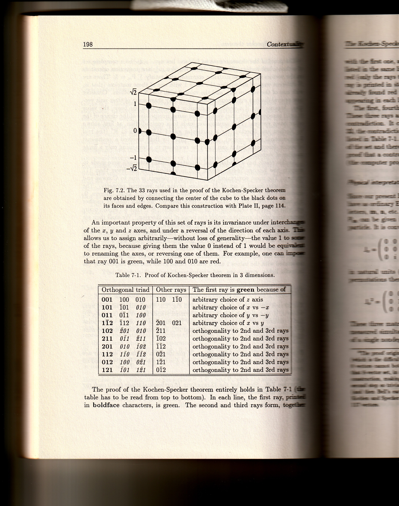

# Peres 33-Vector Kochen-Specker Set (3D)

## Source

Extracted from: A. Peres, *Quantum Theory: Concepts and Methods* (Kluwer, 1993), Chapter 7: Contextuality, pages 197–200.

---

## The Kochen-Specker Theorem (pages 197–198)

A proof of the theorem is as follows. Let $u_1, \ldots, u_N$ be a complete set of proof vectors. The $N$ matrices $P_\mu = u_\mu u_\mu^*$ are projection operators satisfying $u_1, \ldots, u_N$ in mutually orthogonal bases, with $\sum P_\mu = \mathbf{1}$. There are several ways of associating the value 1 with one of these matrices (that is, the value 0 with the $N - 1$ others). Consider a distinct orthogonal basis, which may share some of their unit vectors $u_\mu$ and give 0 with the $N - 1$ others. The assumption that if a vector is a member of more than one basis, the value assigned to that vector is the same, irrespective of the choice of the other vectors, leads to a contradiction, as the proof shows. This assumption — that the value assigned to a projection operator depends only on the projector itself, not on the context in which it is measured — is the assumption of *noncontextuality*.

The most economical proof known at the time of Peres's writing uses only 33 vectors belonging to 16 distinct bases in $\mathbb{R}^3$. That set enjoys a parity proof, using only 20 vectors. However, the purists, including Kochen and Specker themselves, want a complete proof, not only a lemma, and their count is that a minimal proof would have used 10 vectors. Some authors conjecture that a set of $3 \times 8 = 24$ distinct vectors (some of these vectors appear twice in this "master set," as a way leading to a contradiction). Three of the vectors appear twice in this "master set." The second, much longer step is to replace 15 times the same subroutine.

Peres originally gave the theorem with two projection vectors out of a given set (they were originally given by Kochen and Specker themselves in 1967). The first step is to build a set of 33 vectors having the required property. These vectors have values involving only small integers, 0, $\pm 1$ (this symbol stands for $-1$), 2 (means $\sqrt{2}$). Opposite rays, such as $10\bar{2}$ and $\bar{1}0 2$, are counted only once, because they correspond to the same projector.

The values 1 and 0 will be called green and red, respectively (as green = yes, red = no), to refer to that ray's outcome. The 33 proof vectors are shown in Fig. 7.2 below. They will be labelled $x\bar{y}z$; e.g., $\bar{1}$ (this symbol stands for $-1$), $\bar{2}$ (means $\sqrt{2}$).

### Exercises (page 197)

**Exercise 7.6** Show that the 33 rays form 16 orthogonal triads (with each ray appearing in the same number of triads).

**Exercise 7.7** Show that the squares of the direction cosines of each ray are:

$$\frac{1}{2} + \frac{1}{2} + 0 = \frac{1}{2} + \frac{1}{4} + \frac{1}{4} = 1 + 0 + 0 = 1$$

and all components are rational.

---

## Complete List of All 33 Vectors with Coordinates

All vectors use unnormalized components from {0, ±1, ±√2}. Opposite rays (differing by overall sign) are counted once.

### Type I: Coordinate Axes (3 vectors, norm² = 1)

| # | Coordinates (x, y, z) |
|---|----------------------|
| 1 | (1, 0, 0) |
| 2 | (0, 1, 0) |
| 3 | (0, 0, 1) |

### Type II: Face Diagonals (6 vectors, norm² = 2)

| # | Coordinates (x, y, z) |
|---|----------------------|
| 4 | (1, 1, 0) |
| 5 | (1, −1, 0) |
| 6 | (1, 0, 1) |
| 7 | (1, 0, −1) |
| 8 | (0, 1, 1) |
| 9 | (0, 1, −1) |

### Type III: Mixed √2–1–0 Vectors (12 vectors, norm² = 3)

| # | Coordinates (x, y, z) |
|---|----------------------|
| 10 | (√2, 1, 0) |
| 11 | (√2, −1, 0) |
| 12 | (1, √2, 0) |
| 13 | (1, −√2, 0) |
| 14 | (√2, 0, 1) |
| 15 | (√2, 0, −1) |
| 16 | (1, 0, √2) |
| 17 | (1, 0, −√2) |
| 18 | (0, √2, 1) |
| 19 | (0, √2, −1) |
| 20 | (0, 1, √2) |
| 21 | (0, 1, −√2) |

### Type IV: √2–1–1 Vectors (12 vectors, norm² = 4)

| # | Coordinates (x, y, z) |
|---|----------------------|
| 22 | (1, 1, √2) |
| 23 | (1, −1, √2) |
| 24 | (1, 1, −√2) |
| 25 | (1, −1, −√2) |
| 26 | (1, √2, 1) |
| 27 | (1, √2, −1) |
| 28 | (1, −√2, 1) |
| 29 | (1, −√2, −1) |
| 30 | (√2, 1, 1) |
| 31 | (√2, 1, −1) |
| 32 | (√2, −1, 1) |
| 33 | (√2, −1, −1) |

### Direction Cosines²

Each ray's squared direction cosines take one of four forms (all rational):

| Type | Squared direction cosines | Example |
|------|--------------------------|---------|
| I | (1, 0, 0) | (1, 0, 0) |
| II | (1/2, 1/2, 0) | (1, 1, 0)/√2 |
| III | (2/3, 1/3, 0) | (√2, 1, 0)/√3 |
| IV | (1/4, 1/4, 1/2) | (1, 1, √2)/2 |

---

## The 16 Orthogonal Triads

| Triad | Vector #s | Coordinates | Type |
|-------|-----------|-------------|------|
| T1 | {1, 2, 3} | {(1,0,0), (0,1,0), (0,0,1)} | (I, I, I) |
| T2 | {1, 8, 9} | {(1,0,0), (0,1,1), (0,1,−1)} | (I, II, II) |
| T3 | {2, 6, 7} | {(0,1,0), (1,0,1), (1,0,−1)} | (I, II, II) |
| T4 | {3, 4, 5} | {(0,0,1), (1,1,0), (1,−1,0)} | (I, II, II) |
| T5 | {1, 18, 21} | {(1,0,0), (0,√2,1), (0,1,−√2)} | (I, III, III) |
| T6 | {1, 19, 20} | {(1,0,0), (0,√2,−1), (0,1,√2)} | (I, III, III) |
| T7 | {2, 14, 17} | {(0,1,0), (√2,0,1), (1,0,−√2)} | (I, III, III) |
| T8 | {2, 15, 16} | {(0,1,0), (√2,0,−1), (1,0,√2)} | (I, III, III) |
| T9 | {3, 10, 13} | {(0,0,1), (√2,1,0), (1,−√2,0)} | (I, III, III) |
| T10 | {3, 11, 12} | {(0,0,1), (√2,−1,0), (1,√2,0)} | (I, III, III) |
| T11 | {4, 23, 25} | {(1,1,0), (1,−1,√2), (1,−1,−√2)} | (II, IV, IV) |
| T12 | {5, 22, 24} | {(1,−1,0), (1,1,√2), (1,1,−√2)} | (II, IV, IV) |
| T13 | {6, 27, 29} | {(1,0,1), (1,√2,−1), (1,−√2,−1)} | (II, IV, IV) |
| T14 | {7, 26, 28} | {(1,0,−1), (1,√2,1), (1,−√2,1)} | (II, IV, IV) |
| T15 | {8, 31, 32} | {(0,1,1), (√2,1,−1), (√2,−1,1)} | (II, IV, IV) |
| T16 | {9, 30, 33} | {(0,1,−1), (√2,1,1), (√2,−1,−1)} | (II, IV, IV) |

### Triad multiplicity per vector

| Type | Vectors | Triads per vector |
|------|---------|-------------------|
| I (axes) | #1–3 | 4 each |
| II (face diagonals) | #4–9 | 2 each |
| III (mixed √2–1–0) | #10–21 | 1 each |
| IV (√2–1–1) | #22–33 | 1 each |

Total: 3×4 + 6×2 + 12×1 + 12×1 = 12 + 12 + 12 + 12 = 48 = 16 triads × 3 vectors.

### Symmetry

The set is invariant under all permutations of the x, y, z axes and under reversal of any axis direction. This symmetry group (S₃ × Z₂³, order 48) acts on the 33 vectors, organizing them into the four orbits (Types I–IV).

---

## Fig. 7.2 — The 33 Rays and the Cube Diagram (page 198)

**Fig. 7.2.** The 33 rays used in the proof of the Kochen-Specker theorem are obtained by connecting the center of the cube to the black dots on its faces and edges. Compare this construction with Plate II, page 114.

The cube has coordinate values labelled on the vertical axis: $\sqrt{2}$, $1$, $0$, $-1$, $-\sqrt{2}$.

### Symmetry Property

An important property of this set of rays is its invariance under interchange of the $x$, $y$ and $z$ axes, and under a reversal of the direction of each axis. This allows us to assign arbitrarily — without loss of generality — the value 1 to some of the rays, because giving them the value 0 instead of 1 would be equivalent to renaming the axes, or reversing one of them. For example, one can impose that ray 001 is green, while 100 and 010 are red.

---

## Table 7-1: Proof of Kochen-Specker Theorem in 3 Dimensions (page 198)

| Orthogonal triad | Other rays | The first ray is **green** because of |
|------------------|------------|---------------------------------------|
| **001**  100  010 | 110  110 | arbitrary choice of $z$ axis |
| **101**  101  *010* | | arbitrary choice of $x$ vs $-x$ |
| **011**  011  *100* | | arbitrary choice of $y$ vs $-y$ |
| **1$\bar{1}$2**  112  *1$\bar{1}$0* | 201  021 | arbitrary choice of $x$ vs $y$ |
| **102**  *$\bar{2}$01*  010 | 211 | orthogonality to 2nd and 3rd rays |
| **211**  *011*  *$\bar{2}$11* | 102 | orthogonality to 2nd and 3rd rays |
| **201**  010  *10$\bar{2}$* | 1$\bar{1}$2 | orthogonality to 2nd and 3rd rays |
| **112**  1$\bar{1}$0  *1$\bar{1}$$\bar{2}$* | 0$\bar{2}$1 | orthogonality to 2nd and 3rd rays |
| **012**  *100*  *0$\bar{2}$1* | 1$\bar{2}$1 | orthogonality to 2nd and 3rd rays |
| **121**  *101*  *1$\bar{2}$1* | 012 | orthogonality to 2nd and 3rd rays |

The proof of the Kochen-Specker theorem entirely holds in Table 7-1 (the table has to be read from top to bottom). In each line, the first ray, printed in **boldface** characters, is green. The second and third rays form, together with the first one, an orthogonal triad. Therefore they are red. Additional rays in the same line are also orthogonal to the first ray; therefore they too are red (only the rays that will be needed for further work are listed). When a red ray is printed in *italic* characters, this means that it is an "old" ray, that was found red in a preceding line. The choice of colors for the new rays appearing in each line is explained in the last column.

The first, fourth and last lines contain rays 100, 021, and 012, respectively. These three rays are red and mutually orthogonal. It is so even if the deleted ray is explicitly shown in that set of three rays. This is the Kochen-Specker contradiction: it cannot be that a single ray is deleted from that set of three, because the symmetry disappears. It is so even if the deleted ray dissatisfies the examination of alternative choices. That a contradiction can then be avoided is not as simple as in Table 7-1 (a computer program in the Appendix may help).

---

## Orthogonal Pairs and the Full KS Constraint

The 16 triads capture only part of the orthogonality structure. The full set of 33 vectors contains **72 orthogonal pairs** — far more than the 48 triad-slots. These additional pairwise orthogonalities are what make the set KS-uncolorable.

The KS coloring constraints are:
1. **Triad rule**: Each orthogonal triad has exactly 1 green ray and 2 red rays.
2. **Pair rule**: No two orthogonal rays can both be green (since any orthogonal pair in R³ extends to a complete basis).

### Orthogonal neighbor counts

| Type | Vectors | Orthogonal neighbors each |
|------|---------|--------------------------|
| I (axes) | #1–3 | 8 |
| II (face diagonals) | #4–9 | 4 |
| III (mixed √2–1–0) | #10–21 | 4 |
| IV (√2–1–1) | #22–33 | 4 |

The axis vectors are the most constrained: each is orthogonal to 8 other rays.

---

## Computational Verification: KS-Uncolorability

An exhaustive backtracking search over all possible {green, red} assignments confirms:

> **No valid KS coloring exists for the Peres 33-vector set.**

The search explored 47 branches and hit 47 dead ends. Every attempted coloring violates either the triad rule or the pair rule. This is verified by `verify_peres33.py`.

---

## Constructive Proof of the KS Contradiction

The following proof traces through forced assignments step by step, reaching a contradiction on every branch. It uses three WLOG symmetry choices (justified by the cubic symmetry group of the set) and a single binary case split.

### Step 1: Choose v3 = (0,0,1) as GREEN

By the cubic symmetry of the 33-vector set (invariance under axis permutations), we may assume without loss of generality that the z-axis ray v3 is green.

**Forced by pair rule** (all rays orthogonal to v3 must be red):

| Vector | Coordinates | Color | Reason |
|--------|-------------|-------|--------|
| v3 | (0, 0, 1) | **GREEN** | WLOG by cubic symmetry |
| v1 | (1, 0, 0) | RED | orthogonal to v3 |
| v2 | (0, 1, 0) | RED | orthogonal to v3 |
| v4 | (1, 1, 0) | RED | orthogonal to v3 |
| v5 | (1, −1, 0) | RED | orthogonal to v3 |
| v10 | (√2, 1, 0) | RED | orthogonal to v3 |
| v11 | (√2, −1, 0) | RED | orthogonal to v3 |
| v12 | (1, √2, 0) | RED | orthogonal to v3 |
| v13 | (1, −√2, 0) | RED | orthogonal to v3 |

All 8 vectors with z-component = 0 are forced red. (9 of 33 assigned.)

### Step 2: Choose v6 = (1,0,1) as GREEN

Triad T3 = {v2(R), v6, v7} has v2 red, so one of v6 or v7 must be green. By z → −z reflection symmetry, choose v6 = (1,0,1) green WLOG.

| Vector | Coordinates | Color | Reason |
|--------|-------------|-------|--------|
| v6 | (1, 0, 1) | **GREEN** | WLOG by z-reflection |
| v7 | (1, 0, −1) | RED | orthogonal to v6 |
| v27 | (1, √2, −1) | RED | orthogonal to v6 |
| v29 | (1, −√2, −1) | RED | orthogonal to v6 |

(13 of 33 assigned.)

### Step 3: Choose v8 = (0,1,1) as GREEN

Triad T2 = {v1(R), v8, v9} has v1 red, so one of v8 or v9 must be green. By y → −y reflection symmetry, choose v8 = (0,1,1) green WLOG.

| Vector | Coordinates | Color | Reason |
|--------|-------------|-------|--------|
| v8 | (0, 1, 1) | **GREEN** | WLOG by y-reflection |
| v9 | (0, 1, −1) | RED | orthogonal to v8 |
| v31 | (√2, 1, −1) | RED | orthogonal to v8 |
| v32 | (√2, −1, 1) | RED | orthogonal to v8 |

After three symmetry choices and propagation: **17 of 33 assigned, 16 free.**

### Step 4: Case split on v16 = (1, 0, √2)

The remaining 16 free vectors are: {v14, v15, v16, v17, v18, v19, v20, v21, v22, v23, v24, v25, v26, v28, v30, v33}.

We split on v16, which participates in triad T8 = {v2(R), v15, v16} where v2 is already red.

#### Case A: v16 = GREEN

| Vector | Coordinates | Color | Reason |
|--------|-------------|-------|--------|
| v16 | (1, 0, √2) | **GREEN** | case assumption |
| v15 | (√2, 0, −1) | RED | orthogonal to v16 |
| v33 | (√2, −1, −1) | RED | orthogonal to v16 |
| v30 | (√2, 1, 1) | **GREEN** | T16 = {v9(R), v30, v33(R)}: only option |
| v17 | (1, 0, −√2) | RED | orthogonal to v30 |
| v14 | (√2, 0, 1) | **GREEN** | T7 = {v2(R), v14, v17(R)}: only option |
| v24 | (1, 1, −√2) | RED | orthogonal to v14 |
| v25 | (1, −1, −√2) | RED | orthogonal to v14 |
| v23 | (1, −1, √2) | **GREEN** | T11 = {v4(R), v23, v25(R)}: only option |
| v22 | (1, 1, √2) | **GREEN** | T12 = {v5(R), v22, v24(R)}: only option |
| v19 | (0, √2, −1) | RED | orthogonal to v22 |
| v18 | (0, √2, 1) | RED | orthogonal to v23 |
| v21 | (0, 1, −√2) | **GREEN** | T5 = {v1(R), v18(R), v21}: only option |
| v20 | (0, 1, √2) | **GREEN** | T6 = {v1(R), v19(R), v20}: only option |
| v28 | (1, −√2, 1) | RED | orthogonal to v20 |
| v26 | (1, √2, 1) | RED | orthogonal to v21 |

> **CONTRADICTION**: T14 = {v7(R), v26(R), v28(R)} — all three rays are RED. No green ray in this triad.

#### Case B: v16 = RED

| Vector | Coordinates | Color | Reason |
|--------|-------------|-------|--------|
| v16 | (1, 0, √2) | RED | case assumption |
| v15 | (√2, 0, −1) | **GREEN** | T8 = {v2(R), v15, v16(R)}: only option |
| v22 | (1, 1, √2) | RED | orthogonal to v15 |
| v23 | (1, −1, √2) | RED | orthogonal to v15 |
| v25 | (1, −1, −√2) | **GREEN** | T11 = {v4(R), v23(R), v25}: only option |
| v24 | (1, 1, −√2) | **GREEN** | T12 = {v5(R), v22(R), v24}: only option |
| v14 | (√2, 0, 1) | RED | orthogonal to v24 |
| v18 | (0, √2, 1) | RED | orthogonal to v24 |
| v19 | (0, √2, −1) | RED | orthogonal to v25 |
| v21 | (0, 1, −√2) | **GREEN** | T5 = {v1(R), v18(R), v21}: only option |
| v20 | (0, 1, √2) | **GREEN** | T6 = {v1(R), v19(R), v20}: only option |
| v17 | (1, 0, −√2) | **GREEN** | T7 = {v2(R), v14(R), v17}: only option |
| v30 | (√2, 1, 1) | RED | orthogonal to v17 |
| v28 | (1, −√2, 1) | RED | orthogonal to v20 |
| v26 | (1, √2, 1) | RED | orthogonal to v21 |

> **CONTRADICTION**: T14 = {v7(R), v26(R), v28(R)} — all three rays are RED. No green ray in this triad.

### Conclusion

Both cases lead to the same contradiction at **triad T14 = {v7, v26, v28}**. The mechanism is identical in both branches: vectors v20 and v21 are always forced green (by the triad rule, as the last remaining option in T5 and T6), and their orthogonality to v28 and v26 respectively forces those red, leaving T14 with no green ray.

By cubic symmetry (Step 1) and reflection symmetry (Steps 2–3), these three WLOG choices cover all possible colorings. Therefore:

> **No noncontextual {0,1}-assignment consistent with the orthogonality structure of the Peres 33-vector set exists. This proves the Kochen-Specker theorem in dimension 3.**

---

## Physical Interpretation (page 199)

Since our present Hilbert space is isomorphic to $\mathbb{R}^3$, the abstract vectors in it become ordinary Euclidean vectors. We shall therefore denote them by boldface letters, **m**, **n**, etc. A simple physical interpretation of the projection operator can be given in terms of the angular momentum components of a spin 1 particle. It is convenient to use a representation where

$$\mathbf{J}_x = \begin{pmatrix} 0 & 0 & 0 \\ 0 & 0 & -i \\ 0 & i & 0 \end{pmatrix}, \quad \mathbf{J}_y = \begin{pmatrix} 0 & 0 & i \\ 0 & 0 & 0 \\ -i & 0 & 0 \end{pmatrix}, \quad \mathbf{J}_z = \begin{pmatrix} 0 & -i & 0 \\ i & 0 & 0 \\ 0 & 0 & 0 \end{pmatrix} \quad (7.26)$$

(as usual with $j = 1$). These matrices satisfy $[J_k, J_l] = i\epsilon_{klm} J_m$, and cyclic permutations thereof. With this representation, we have

$$J_x^2 = \begin{pmatrix} 0 & 0 & 0 \\ 0 & 1 & 0 \\ 0 & 0 & 1 \end{pmatrix}, \quad J_y^2 = \begin{pmatrix} 1 & 0 & 0 \\ 0 & 0 & 0 \\ 0 & 0 & 1 \end{pmatrix}, \quad J_z^2 = \begin{pmatrix} 1 & 0 & 0 \\ 0 & 1 & 0 \\ 0 & 0 & 0 \end{pmatrix} \quad (7.27)$$

These three matrices commute, so that the corresponding observables can be simultaneously measured. One may actually consider all the $J_\mu^2$ as functions of a single nondegenerate operator.

---

## Equations and Further Development (page 200)

$$\mathbf{K} = J_x^2 - J_y^2 = \begin{pmatrix} -1 & 0 & 0 \\ 0 & 1 & 0 \\ 0 & 0 & 0 \end{pmatrix}. \quad (7.28)$$

**Exercise 7.9** Show that $J_x^2 = \mathbf{1} + (K - K^2)/2$, and write likewise $J_y^2$ and $J_z^2$ as functions of $K$.

**Exercise 7.10** Write explicitly the three matrices $J_k J_l + J_l J_k$ (for $k \neq l$) and show that, for any real unit vector **m**, the matrix

$$\mathbf{P_m} = \mathbf{1} - (\mathbf{m} \cdot \mathbf{J})^2, \quad (7.29)$$

has components $(\mathbf{P_m})_{rs} = m_r m_s$, and therefore is a *projection operator*.

A measurement of the projector $\mathbf{P_m}$ is a test of whether the spin component along the unit vector **m** is equal to zero. The eigenvalue 1 corresponds to the answer "yes," and the degenerate eigenvalues 0 to the answer "no." Note that this test is essentially different from an ordinary Stern-Gerlach experiment which would measure the spin component along **m**, because the degenerate matrix $\mathbf{P_m}$ makes no distinction between $-1$ and $+1$ of $\mathbf{m} \cdot \mathbf{J}$.

A generalization of (7.28), for two orthogonal unit vectors **m** and **n**, is:

$$K(\mathbf{m}, \mathbf{n}) = (\mathbf{m} \cdot \mathbf{J})^2 - (\mathbf{n} \cdot \mathbf{J})^2. \quad (7.30)$$

This operator has eigenvalues $-1$, $0$, and $1$. A direct measurement of $K(\mathbf{m}, \mathbf{n})$ is difficult, but it is technically possible, and a single operation can thereby determine the "colors" of the triad **m**, **n** and **m** $\times$ **n**.

The 33 rays that were used in the proof of the Kochen-Specker theorem form 16 orthogonal triads (see Exercise 7.8). These triads correspond to 16 different and **noncommuting** operators of the same type as $K(\mathbf{m}, \mathbf{n})$. Any one of them, but only one, can actually be measured. The results of the other measurements are counterfactual — and mutually contradictory.

---

## Twenty Rays in $\mathbb{R}^4$ (page 200)

Consider again our pair of spin $\frac{1}{2}$ particles. Recall that in array (7.1), each row and each column is a *complete* set of commuting operators. The product of the three operators in each row or column is $\mathbf{1} \otimes \mathbf{1}$, except for those of the third column, whose product is $-\mathbf{1} \otimes \mathbf{1}$. It is obviously impossible to associate, with each one of these nine operators, numerical values 1 or $-1$, that would obey the same multiplication rule as the operators themselves.

This algebraic impossibility will now be rephrased in the geometric language of the Kochen-Specker theorem. The common eigenvectors of the commuting operators in each row and each column of (7.1) form a complete orthogonal basis. We thus have 6 orthogonal bases, with a total of 24 vectors. The impossible assignment is to "paint" them in such a way that one vector of each basis is green.

---

## References

- A. Peres, *Quantum Theory: Concepts and Methods*, Kluwer Academic Publishers (1993), Chapter 7
- A. Peres, "Two simple proofs of the Kochen-Specker theorem," *J. Phys. A: Math. Gen.* **24**, L175 (1991)
- S. Kochen and E. P. Specker, "The Problem of Hidden Variables in Quantum Mechanics," *J. Math. Mech.* **17**, 59–87 (1967)
- M. Kernaghan, "Bell-Kochen-Specker theorem for 20 vectors," *J. Phys. A: Math. Gen.* **27**, L829 (1994)
